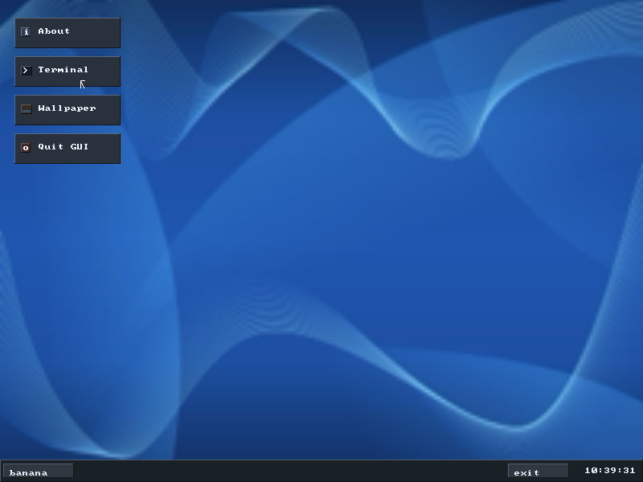

# 🍌 Banana OS 0.5

Banana OS 0.5 is a minimal x86 operating system written from scratch (no Linux kernel, no external OS kernel), bootable in VirtualBox/QEMU via GRUB + Multiboot2 - now with **real networking**: its own drivers for the Intel e1000 and Realtek RTL8139 network cards and its own TCP/IP stack, so `ping`, `curl` and `wget` talk to the actual Internet (HTTP and HTTPS).

```
  ____                               ____  ____
 | __ )  __ _ _ __   __ _ _ __   __|  _ \/ ___|
 |  _ \ / _` | '_ \ / _` | '_ \ / _` | | \___  \
 | |_) | (_| | | | | (_| | | | | (_| | |___)  |
 |____/ \__,_|_| |_|\__,_|_| |_|\__,_|___/____/
```



## What's new in 0.5

- **Networking** - PCI NIC drivers (Intel e1000 / 82540EM, the default card in QEMU and VirtualBox, and Realtek RTL8139) and a from-scratch TCP/IP stack: Ethernet, ARP, IPv4, ICMP, UDP, DHCP, DNS and TCP (retransmission with RTT-based timeouts, fast retransmit, congestion + flow control, out-of-order reassembly)
- **`ping`, `curl`, `wget`, `nslookup`, `ifconfig`, `netstat`, `arp`, `dhcp`** - working against real hosts
- **USB** - xHCI + EHCI host controllers, USB keyboards and mice, and USB network adapters: **Realtek RTL8152/8152B (Lanberg NC-0100-01)** and CDC-ECM; `lsusb`, hot-plug with `usb rescan`
- **HTTPS** - a TLS 1.3 client (X25519, AES-128-GCM, ChaCha20-Poly1305, SHA-256/HKDF, all written from the RFCs, with known-answer self-tests: `cryptotest`)
- **Your own wallpapers** - download a PNG/JPEG/BMP/GIF with `wget` (or `wallpaper url ...`) and use it; pick it in the Wallpaper app or with the `wallpaper` command. The choice is saved and survives reboots on an installed disk
- **Real files** - files are no longer capped at 2 KiB: data lives on a new kernel heap (up to 32 MiB per file), binary files are fine, and installed disks from 0.4 are upgraded automatically
- **Faster, cooler** - timer interrupts + `hlt` instead of busy polling: an idle Banana OS went from pinning a host CPU core at **100% to ~6%**; the console prints ~100x faster (an 8000-line file: 27.8 s -> 0.27 s); the desktop only repaints what changed
- **Serial console** - the shell also runs on COM1 (`-serial stdio`), which makes Banana OS scriptable and testable headless

## Project Layout

```
Banana-OS/
├── boot/
│   ├── boot.asm        # Multiboot2 entry point (assembly)
│   └── linker.ld       # Linker script (exports _kernel_end for the heap)
├── kernel/
│   ├── kernel.c        # kernel_main()
│   ├── idt.c, isr.asm  # CPU exceptions (panic screen) + PIC / hardware IRQs
│   ├── timer.c         # PIT at 1 kHz on IRQ0, hlt-based idle
│   ├── task.c/h        # Cooperative kernel threads; the scheduler halts when all sleep
│   ├── kheap.c         # Kernel heap (first-fit, coalescing) over the Multiboot2 memory map
│   ├── kstring.c       # memcpy/memset/..., ksnprintf
│   ├── serial.c        # COM1 console: mirrored output (async), keyboard input
│   ├── pci.c           # PCI configuration space + bus scan
│   ├── random.c        # CSPRNG (ChaCha20 keyed from a SHA-256 entropy pool)
│   ├── terminal.c/h    # Terminal (VGA + framebuffer + virtual terminals), deferred painting
│   ├── fb.c, gfx.c     # Framebuffer + 2D drawing
│   ├── gui.c/h         # Desktop GUI (taskbar/start menu/windows/wallpaper app)
│   ├── wallpaper.c     # Wallpaper presets, user images, /etc/wallpaper
│   ├── image.c         # Image decoding (via stb_image) + resampling
│   ├── fs.c, fsdisk.c  # In-memory Unix-like FS + on-disk persistence
│   └── keyboard.c ...  # PS/2 keyboard/mouse, ATA/ATAPI, RTC, USB handoff
├── net/
│   ├── e1000.c         # Intel 8254x NIC driver
│   ├── rtl8139.c       # Realtek RTL8139 NIC driver
│   ├── usbnet.c        # Shared plumbing for USB network adapters
│   ├── r8152.c         # Realtek RTL8152/8152B USB Ethernet (Lanberg NC-0100-01, ...)
│   ├── cdc_ecm.c       # USB CDC-ECM class Ethernet (QEMU usb-net, phones, ...)
│   ├── net.c           # Interfaces (eth0, usb0), Ethernet, netd task
│   ├── arp.c ip.c icmp.c udp.c dhcp.c dns.c tcp.c
│   ├── tls.c           # TLS 1.3 client
│   └── http.c          # HTTP/1.1 client (curl, wget)
├── crypto/             # SHA-256/HMAC/HKDF, ChaCha20, Poly1305, AES-128-GCM, X25519, self-tests
├── shell/
│   ├── shell.c/h       # Banana shell
│   ├── netcmds.c       # ifconfig, ping, curl, wget, ...
│   ├── wpcmd.c         # wallpaper command
│   └── editor.c/h      # Nano-like text editor
├── third_party/        # stb_image (runtime image decoding), lodepng
├── iso/boot/grub/grub.cfg
├── Makefile
├── build.sh
└── README.md
```

## Features

- Bare-metal x86 kernel (freestanding C + NASM)
- Multiboot2 boot flow with framebuffer mode
- IDT-based exception handling with a panic screen instead of silent triple-faults
- Interrupt-driven timer; the CPU sleeps (`hlt`) whenever every task is idle
- Kernel heap over all available RAM
- Dual terminal backend:
  - VGA text mode
  - Framebuffer-rendered console
- GUI desktop (started on demand with `startx`)
- PS/2 keyboard + PS/2 mouse support, plus real Synaptics PS/2 touchpad support (absolute mode + tap-to-click)
- Ctrl+Alt+Delete closes the GUI, from anywhere
- Up to 4 draggable, closable, focusable terminal windows in GUI mode, each with its own independent shell task and scrollback
- Fluxbox-inspired dark desktop theme, with network status in the taskbar
- Wallpaper app with 10 built-in presets plus your own pictures from `~/Pictures`
- In-memory Unix-style filesystem (`/bin`, `/etc`, `/home/banana`, `/usr`, `/var`, `/tmp`, `/dev`, `/root`) with absolute/relative path resolution, `.`/`..`/`~`, files up to 32 MiB (text or binary)
- POSIX-flavored shell utilities (`ls -l`, `mkdir -p`, `rm -r`, `cp`, `mv`, `touch`, `whoami`, `hostname`, `date`, `time`, ...)
- Two shell personas sharing one command engine - stock `sh` (default) and a bash-compatible `bash` (aliases, `export`/`$VAR`, `!!`) - selectable per-session with `chsh`
- Built-in editor and live system monitor
- Networking: e1000 + RTL8139 drivers, USB adapters (RTL8152/8152B, CDC-ECM), TCP/IP stack, DHCP, DNS, HTTP + HTTPS (TLS 1.3)
- Real bootable disk install (`install`/`sync`) - installs onto a dedicated ATA hard disk so Banana OS boots on its own, with a persistent filesystem, no CD required
- Serial console on COM1 (output mirror + input)

# Minimum Requirements

- CPU : Yes (i686 or newer)
- RAM : 32 MB (256 MB recommended - decoding a large photo for a wallpaper needs width x height x 3 bytes)
- GPU : any sort of graphics accelerator should do it
- Keyboard / Mouse : PS/2
- Network : Intel e1000 (82540EM/82545EM), Realtek RTL8139, or a USB adapter (Realtek RTL8152/8152B such as the Lanberg NC-0100-01, CDC-ECM) - optional
- USB : xHCI or EHCI controller for USB devices - optional
- Not hating AI slop

## GUI Overview (`startx`)

- 800x600 framebuffer desktop, Azure Flow wallpaper by default
- Taskbar with:
  - `Start` button
  - network status (`eth0 10.0.2.15`)
  - `Quit` button
  - live clock
- Start menu and desktop shortcuts, both with the same entries:
  - About app
  - Terminal
  - Wallpaper
  - Quit GUI
- Wallpaper app - pick one of 10 built-in presets, or one of your own pictures from `~/Pictures`
- Up to 4 terminal windows (draggable, closable, focusable, scrollable), each running its own independent shell task
- PS/2 mouse and Synaptics touchpad (absolute mode + tap-to-click) both work for pointing
- Ctrl+Alt+Delete quits the GUI immediately, from anywhere

## Networking

Banana OS brings up the network card by itself at boot and configures it with **DHCP** in the background - by the time you're at the prompt, `ifconfig` usually already shows an address.

```
ifconfig                              # interface, address, gateway, DNS, packet counters
ping -c 3 example.com                 # ICMP echo (Ctrl+C stops)
nslookup github.com                   # DNS lookup
curl http://example.com               # print a page
curl -L -o page.html https://github.com  # follow redirects, save to a file
curl -I https://example.com           # headers only
curl -v https://example.com           # show the connection, TLS cipher, request and response headers
wget https://raw.githubusercontent.com/nothings/stb/master/README.md   # download a file
netstat                               # TCP connections
arp                                   # ARP cache
dhcp                                  # renew the DHCP lease
ifconfig eth0 192.168.1.50 netmask 255.255.255.0 gw 192.168.1.1 dns 1.1.1.1   # static setup
```

What's implemented, all from scratch:

| Layer | |
|---|---|
| NIC drivers | Intel 8254x "e1000" (DMA descriptor rings, IRQ wakeups), Realtek RTL8139, USB: Realtek RTL8152/8152B, CDC-ECM |
| Link | Ethernet II, ARP (cache, request queueing), loopback |
| Network | IPv4 (routing via default gateway, DF, no fragmentation), ICMP echo request/reply |
| Transport | UDP, TCP (3-way handshake, sliding window, RTT-estimated retransmission timeout with backoff, fast retransmit, slow start/congestion avoidance, out-of-order reassembly, delayed ACKs, zero-window probing, orderly close) |
| Services | DHCP client (with lease renewal), DNS resolver (with CNAMEs + cache) |
| Security | TLS 1.3 client: X25519, TLS_AES_128_GCM_SHA256, TLS_CHACHA20_POLY1305_SHA256 |
| Application | HTTP/1.1 client: Content-Length, chunked encoding, redirects |

> ⚠️ **HTTPS note:** TLS encrypts and authenticates the whole session (the handshake transcript and Finished MACs are verified), but Banana OS ships no certificate authority store, so it does **not** verify the server's certificate - like `curl --insecure`. That protects against eavesdropping, not against an active man-in-the-middle. Don't use it for anything sensitive.

### QEMU

```bash
make run            # e1000 NIC on QEMU user-mode (NAT) networking, serial console on this terminal
make run-rtl8139    # same, with the RTL8139 card
make run-headless   # no window: use Banana OS entirely through the serial console
```

or by hand:

```bash
qemu-system-i386 -cdrom Banana_OS.iso -m 256 -nic user,model=e1000
```

QEMU's user-mode networking gives the guest `10.0.2.15`, a gateway at `10.0.2.2` and DNS at `10.0.2.3` via DHCP, and NATs TCP/UDP to the real Internet. For **ping** to reach Internet hosts, QEMU forwards ICMP with unprivileged "ping sockets", which a Linux host has to allow (pinging `10.0.2.2` always works):

```bash
sudo sysctl -w net.ipv4.ping_group_range="0 2147483647"
# in an unprivileged LXC container the range must fit the container's ID map:  "0 65535"
```

For the guest to sit directly on your LAN instead of behind NAT, bridge it with a tap device (`make run-tap` expects `tap0` to exist and be part of a bridge).

### VirtualBox

Use the default network adapter: **Settings → Network → Adapter 1 → Attached to: NAT** (or *Bridged Adapter* to join your LAN), adapter type **Intel PRO/1000 MT Desktop (82540EM)**. The *Intel PRO/1000 T Server* and *MT Server* types work too; the PCnet and virtio adapters are not supported.

## USB

Banana OS 0.5 has its own USB stack: **xHCI** (USB 3.x) and **EHCI** (USB 2.0) host controllers, device enumeration and hot-plug (`usb rescan`), and these drivers:

| Driver | Devices |
|---|---|
| `r8152` | **Realtek RTL8152 / RTL8152B** USB 2.0 Fast Ethernet (`0bda:8152`): **Lanberg NC-0100-01**, TP-Link UE200 and most "USB 2.0 to RJ45" dongles |
| `cdc_ecm` | Class-compliant USB Ethernet (CDC-ECM): QEMU `usb-net`, many adapters, phone USB tethering |
| `usbhid` | USB keyboards and mice (boot protocol) |
| `usb-storage` | USB sticks / disks are identified (model, size) - not mounted yet |

A USB network adapter shows up as **`usb0`** next to the PCI card (`eth0`). When one is plugged in it becomes the active interface and gets an address by DHCP; `ifconfig eth0 up` / `ifconfig usb0 up` switch between them (Banana OS uses one interface at a time).

```
lsusb                 # controllers and devices, with the bound driver
usb rescan            # pick up a device plugged in (or removed) after boot
ifconfig              # every interface; the active one is marked UP
ifconfig usb0 up      # use the USB adapter
```

### Lanberg NC-0100-01 (RTL8152B)

- **Real PC:** plug it into any USB port driven by an xHCI or EHCI controller (all PCs of the last ~15 years). If the firmware has "legacy USB" / "xHCI hand-off" options, either setting works.
- **QEMU:** pass the adapter through from the host:
  ```bash
  qemu-system-i386 -cdrom Banana_OS.iso -m 256 -device qemu-xhci -device usb-host,vendorid=0x0bda,productid=0x8152
  ```
  (QEMU needs permission to the device node: run it as root or add a udev rule for `0bda:8152`.)
- **VirtualBox:** install the Extension Pack, **Settings → USB → USB 2.0 (EHCI) or USB 3.0 (xHCI) Controller**, then add a USB device filter for *Realtek USB 10/100 LAN*.

> ⚠️ The RTL8152 driver was written from the chip's register documentation in OpenBSD's `ure(4)` driver; QEMU cannot emulate this chip, so it has been tested in emulation only up to the USB layer. If it does not come up, `lsusb` and the boot messages (`r8152: ...`) tell what happened.

Limitations: no USB hubs (plug devices directly into a root port), no UHCI/OHCI controllers - on EHCI-only machines full/low-speed devices (most keyboards and mice) are handed to the companion controller and stay on PS/2 emulation; USB sticks are not mounted.

## Wallpapers

Built-in presets, or any PNG, JPEG (baseline or progressive), BMP or GIF you put on the filesystem:

```bash
# download a picture and use it in one go (saved to ~/Pictures)
wallpaper url https://picsum.photos/id/1018/1920/1080

# or step by step
wget -O ~/Pictures/mountains.jpg https://example.com/mountains.jpg
wallpaper ~/Pictures/mountains.jpg          # fill the screen (crop to fit)
wallpaper ~/Pictures/mountains.jpg fit      # letterbox instead; also: stretch, center

wallpaper list                              # presets + your pictures
wallpaper preset "Ocean Wave"
wallpaper reset                             # back to Azure Flow
```

In the GUI, the **Wallpaper** app lists the presets and everything in `~/Pictures` - click to apply. The choice is stored in `/etc/wallpaper`, so on an installed disk it survives reboots (run `sync`, or just shut down).

Large photos are downscaled with area averaging (sharp, no aliasing) - a 3840x2160 JPEG decodes and applies in about a second in QEMU.

## Filesystem Layout

Banana OS seeds a small Unix-style root hierarchy at boot (in-memory, reset on reboot unless installed):

```
/
├── bin/
├── etc/            (motd, hostname, passwd, wallpaper)
├── home/
│   └── banana/     ($HOME - shell starts here, readme.txt)
│       └── Pictures/  (your wallpapers)
├── root/
├── usr/
├── var/
├── tmp/
└── dev/
```

Every path-taking command accepts absolute (`/etc/motd`), relative (`../etc`), `.`/`..`, and `~` (home) paths, just like a real Unix shell.

## Shells

Banana OS ships two shell **personas** built on one shared command engine (same builtins, same filesystem, same history) - only the prompt, banner, and a handful of bash-only builtins differ:

| | `sh` (stock, default) | `bash` (opt-in) |
|---|---|---|
| Prompt | `banana` (yellow) `@banana-os-0.5` (green) `:path$ ` | `banana@banana-os-0.5` (all green) `:path$ ` |
| `uname` / `neofetch` | reports `sh` | reports `bash` |
| Aliases, `export`/`$VAR`, `!!` | available (shared engine) | available |

Switch which persona **new** shells boot into with `chsh` - like real Unix `chsh(1)`, it only affects future sessions (new terminal windows, or the next reboot), never the one you ran it from:

```
chsh          # show the current default and this session's persona
chsh bash     # make new shells start as the bash persona
chsh sh       # switch back to the stock shell
```

Bash-flavored extras (available in both personas, since they share one engine):

- `alias [name[=value]]`, `unalias <name>` - e.g. `alias ll='ls -l'`
- `export [NAME=value]`, `unset <name>`, `env` - environment variables; `$NAME` expands inline (`echo $HOME`, `echo $SHELL`)
- `!!` - re-runs (and re-records) the previous command
- `type <cmd>` - like `which`, but alias-aware

## Available Commands

| Command | Description |
|---|---|
| `help` | Show command list |
| `neofetch` | Show system information |
| `echo <text>` | Print text |
| `clear` | Clear screen |
| `uname` | Show OS/kernel string |
| `whoami` | Print current user |
| `hostname` | Print system hostname |
| `date` | Print current date/time (from RTC) |
| `ls [-l] [path]` | List a directory (long format with `-l`) |
| `pwd` | Print current directory (full absolute path) |
| `cd [path]` | Change directory (no arg or `~` goes home, `..` up) |
| `mkdir [-p] <dir>` | Create directory (`-p` creates parents too) |
| `rm [-r] <name>` | Remove a file, or a directory with `-r` |
| `touch <file>` | Create an empty file (or no-op if it exists) |
| `cp <src> <dst>` | Copy a file |
| `mv <src> <dst>` | Move/rename a file or directory |
| `edit <file>` | Open built-in nano-like editor |
| `cat <file>` | Print file contents (binary files are refused) |
| `grep [-n] <pattern> <file>` | Print lines matching a substring (`-n` numbers them) |
| `wc <file>` | Count lines/words/bytes in a file |
| `head [-n N] <file>` | Print first N lines (default 10) |
| `tail [-n N] <file>` | Print last N lines (default 10) |
| `find [path] [-name <sub>]` | Recursively list files/dirs under path |
| `history` | Show command history |
| `which <cmd>` | Show whether a command is a shell builtin |
| `type <cmd>` | Like `which`, but alias-aware (bash-flavored) |
| `alias [name[=value]]` | List/define a command alias (bash-flavored) |
| `unalias <name>` | Remove an alias |
| `export [NAME=value]` | List/set an environment variable |
| `unset <name>` | Remove an environment variable |
| `env` | List environment variables |
| `chsh [sh\|bash]` | Show/set the default shell persona for new sessions |
| `run <file.sh>` | Execute script line by line |
| `time <command>` | Run a command and print its wall-clock time |
| `uptime` | Show uptime |
| `top` | Live CPU/RAM/process monitor (`q` to quit) |
| `ram_info [-t -u -h -f -p -m]` | Memory usage, including the kernel heap (`-h`) |
| `startx` | Start GUI desktop |
| `stopx` | Quit GUI desktop |
| `start` | Alias of `startx` |
| `stop` | Alias of `stopx` |
| `keyboardctl [layout]` | Show/set keyboard layout (`EN (Default)`, `fr_CH`, `FR`, `DE`, `de_CH`, `BEPO`) |
| `loadctl [layout]` | Alias of `keyboardctl` |
| `usbctl` | Show USB legacy handoff state |
| `shutdown [now\|-c]` | Schedule shutdown (60s), immediate shutdown, or cancel |
| `reboot` | Immediate reboot |
| `halt` | Hard CPU halt |
| `install` | Install Banana OS onto a dedicated ATA hard disk - bootable, with a persistent filesystem |
| `sync` | Re-write the filesystem to the installed disk on demand |
| **Networking** | |
| `ifconfig [<if> <ip> [netmask m] [gw g] [dns d]]` | Show the interfaces, or configure one statically |
| `ifconfig <if> up` | Make `eth0` or `usb0` the active interface |
| `lsusb` | List USB controllers and devices |
| `usb rescan` | Detect USB devices plugged in or removed since boot |
| `dhcp` | Request a new DHCP lease |
| `ping [-c N] [-s size] [-i sec] <host>` | ICMP echo (default 4 packets; Ctrl+C stops) |
| `nslookup <host>` / `host <host>` | Resolve a name with DNS |
| `curl [-L] [-o file\|-O] [-I] [-i] [-v] [-s] [-A ua] [--tls13-ciphers ..] <url>` | HTTP/HTTPS client |
| `wget [-q] [-O file] <url>` | Download a file (follows redirects) |
| `netstat` | TCP connections |
| `arp` | ARP cache |
| `cryptotest` | Run the TLS crypto known-answer self-tests |
| **Wallpaper** | |
| `wallpaper [list\|reset\|preset <n>\|url <url>\|<file> [fill\|fit\|stretch\|center]]` | Show or change the desktop wallpaper |

## Installing to a Hard Disk (`install` / `sync`)

By default Banana OS boots from the GRUB CD/ISO every time and its filesystem is in-memory only, reset on every reboot. `install` does a real install onto a **second, dedicated IDE/ATA hard disk** attached to the VM (never the GRUB boot CD - the driver detects and skips ATAPI/optical drives):

```bash
# QEMU: create a blank disk image (64 MB+; 32 MB is reserved for the boot
# image, the rest holds your files - downloads and pictures included)
qemu-img create -f raw disk.img 128M
qemu-system-i386 -cdrom Banana_OS.iso -m 256 -nic user,model=e1000 -drive file=disk.img,format=raw,if=ide
```

In VirtualBox, attach a second blank virtual hard disk (IDE, 128 MB+) to the same VM that boots `Banana_OS.iso`.

Then, inside Banana OS:

```
install     # copies the boot image onto the disk and writes the current filesystem to it
sync        # re-writes the filesystem on demand (also happens automatically on shutdown/reboot/halt)
```

`install` works because `grub-mkrescue` already builds `Banana_OS.iso` as a GRUB "hybrid" image - the same trick that lets Linux live ISOs be `dd`'d straight onto a USB stick or disk and boot with no CD. `install` raw-copies that already-bootable image from the CD onto the target disk via a small ATAPI driver, then writes the filesystem into a reserved region right after it - no custom bootloader needed.

Once installed, the disk boots Banana OS **on its own** - drop `-cdrom Banana_OS.iso` entirely:

```bash
qemu-system-i386 -m 256 -nic user,model=e1000 -drive file=disk.img,format=raw,if=ide
```

Every boot after that loads the filesystem back from disk instead of reseeding the defaults, so your files persist too.

**Upgrading from 0.4:** boot the 0.5 CD with your old disk attached (`-boot d` in QEMU, so the CD wins over the bootable disk). 0.5 reads the old 0.4 filesystem format, converts it, and writes it back in the new format. Run `install` from the 0.5 CD afterwards to update the disk's own boot image as well.

## Build (Ubuntu/Debian)

### Quick build

```bash
chmod +x build.sh
./build.sh
```

### Manual build

```bash
sudo apt-get install nasm gcc-multilib grub-pc-bin grub-common xorriso mtools
make
# Output: Banana_OS.iso
```

## Run in VirtualBox

1. Create a new VM:
   - Name: `Banana OS 0.5`
   - Type: `Other`
   - Version: `Other/Unknown (32-bit)`
2. Assign at least **32 MB RAM** (256 MB recommended)
3. Network: Adapter 1, **NAT**, **Intel PRO/1000 MT Desktop**
4. No virtual disk required (add one to use `install`)
5. Attach `Banana_OS.iso` as optical media
6. Boot

## Run in QEMU

```bash
make run
# or
qemu-system-i386 -cdrom Banana_OS.iso -m 256 -nic user,model=e1000 -serial stdio
```

## Technical Notes

- **Bootloader**: GRUB 2 (Multiboot2)
- **Language**: freestanding C + NASM, no floating point (integer-only graphics and crypto)
- **Graphics**: 32-bit framebuffer + 8x8 bitmap font; the console paints lazily (dirty rows, coalesced scrolling)
- **Interrupts**: PIC remapped to vectors 32-47; IRQ0 (1 kHz timer) and the NIC's IRQ are used, keyboard/mouse stay polled
- **Scheduling**: cooperative kernel threads; with nothing to run the CPU halts until the next interrupt
- **Memory**: no paging (physical = virtual), kernel heap from the Multiboot2 memory map, so heap buffers double as DMA buffers
- **Input**:
  - PS/2 keyboard (`0x60` / `0x64`)
  - PS/2 mouse AUX packets
  - COM1 serial
- **Kernel load address**: `0x100000` (1 MiB)

## 100% Custom Kernel

This project uses no existing OS kernel:

- custom assembly entry point
- custom framebuffer + terminal stack
- custom keyboard/mouse handling
- custom shell and in-memory filesystem
- custom NIC drivers, TCP/IP stack and TLS
- custom linker script and build chain

The only third-party code is GRUB (bootloader) and the stb_image / lodepng image decoders - see `THIRD-PARTY-NOTICES`.
