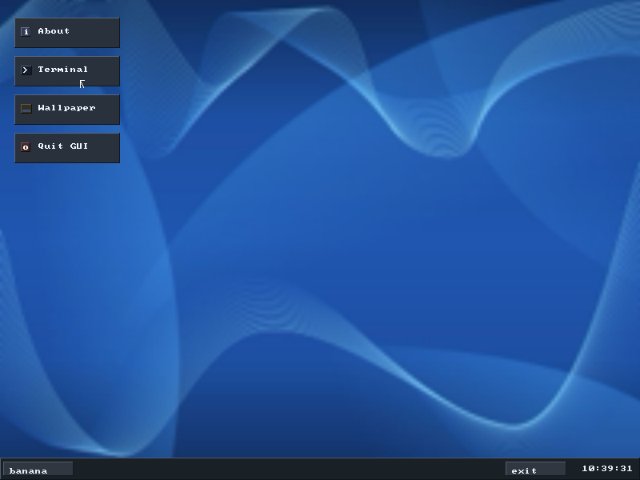

# 🍌 Banana OS 0.5

Banana OS 0.5 is a minimal x86 operating system written from scratch (no Linux kernel, no external OS kernel) - a **64-bit (x86_64) kernel with a 32-bit fallback**, booting on **UEFI and BIOS** machines and in VirtualBox/QEMU via GRUB + Multiboot2 - now with **real networking**: its own drivers for the Intel e1000 and Realtek RTL8139 network cards and its own TCP/IP stack, so `ping`, `curl` and `wget` talk to the actual Internet (HTTP and HTTPS).

```
  ____                               ____  ____
 | __ )  __ _ _ __   __ _ _ __   __|  _ \/ ___|
 |  _ \ / _` | '_ \ / _` | '_ \ / _` | | \___  \
 | |_) | (_| | | | | (_| | | | | (_| | |___)  |
 |____/ \__,_|_| |_|\__,_|_| |_|\__,_|___/____/
```



## Latest additions

- **Apps and a Linux SDK** - write apps in C on Linux with the SDK in [`sdk/`](sdk/README.md) (C library, windows, drawing, mouse/keyboard events, files, sound, HTTP); one `make` builds them for both kernels into a `.bpk` package. Install with `pkg install app.bpk` or a double-click in Files, run them by name or from **Apps** on the desktop. Five examples come built in (`~/Examples`)
- **USB sticks (FAT32)** - plugged-in sticks are mounted at `/mnt/usb`, read and write, long file names included; every tool works on them (`ls`, `cp`, Files, the browser, `pkg install`...). `umount` ejects
- **NVMe SSDs** - a polled NVMe driver: NVMe disks are install targets (and boot on UEFI), FAT32 partitions are mounted at `/mnt/nvme`
- **Sound** - Intel HD Audio and AC'97 drivers (QEMU, VirtualBox, many real PCs) and the PC speaker: `play file.wav`, `beep`, `volume`, and sound for apps
- **Windows-like taskbar** - a button per open window (click: focus, click again: minimize), minimize buttons, *Show the desktop*
- **Task Manager** - windows and apps (Switch to / End task), the kernel's tasks with their CPU use, live CPU and memory graphs; from the desktop, the Start menu or a right-click on the taskbar
- **Right-click menus everywhere** - desktop, taskbar, terminals (copy, paste, clear), Files (open, install, rename, cut/copy/paste, delete, new file/folder, eject), the browser (open/save link, back, reload, page source...), Notepad
- **Browser downloads** - anything that is not a web page (apps, archives, programs...) is saved to `~/Downloads`; *Save link as* / *Save page as* in the right-click menu
- **UEFI fixes** - device registers above 4 GiB (where UEFI firmware puts NVMe, GPUs...) are mapped on demand, and the desktop uses whatever resolution the firmware gives (not only 800x600)

## What's new in 0.5

- **64-bit** - the kernel also builds for x86_64 (long mode, 4 GiB identity-mapped with 2 MiB pages); one ISO carries both kernels and its boot menu picks the 64-bit one when the CPU supports it, the 32-bit one otherwise
- **UEFI** - the ISO (and a disk made with `install`) boots on UEFI firmware as well as on BIOS; `neofetch` shows which one started it
- **Networking** - PCI NIC drivers (Intel e1000 / 82540EM, the default card in QEMU and VirtualBox, and Realtek RTL8139) and a from-scratch TCP/IP stack: Ethernet, ARP, IPv4, ICMP, UDP, DHCP, DNS and TCP (retransmission with RTT-based timeouts, fast retransmit, congestion + flow control, out-of-order reassembly)
- **`ping`, `curl`, `wget`, `nslookup`, `ifconfig`, `netstat`, `arp`, `dhcp`** - working against real hosts
- **USB** - xHCI + EHCI host controllers, USB keyboards and mice, and USB network adapters: **Realtek RTL8152/8152B (Lanberg NC-0100-01)** and CDC-ECM; `lsusb`, hot-plug with `usb rescan`
- **HTTPS** - a TLS 1.3 client (X25519, AES-128-GCM, ChaCha20-Poly1305, SHA-256/HKDF, all written from the RFCs, with known-answer self-tests: `cryptotest`)
- **Your own wallpapers** - download a PNG/JPEG/BMP/GIF with `wget` (or `wallpaper url ...`) and use it; pick it in the Wallpaper app or with the `wallpaper` command. The choice is saved and survives reboots on an installed disk
- **Real files** - files are no longer capped at 2 KiB: data lives on a new kernel heap (up to 32 MiB per file), binary files are fine, and installed disks from 0.4 are upgraded automatically
- **Faster, cooler** - timer interrupts + `hlt` instead of busy polling: an idle Banana OS went from pinning a host CPU core at **100% to ~6%**; the console prints ~100x faster (an 8000-line file: 27.8 s -> 0.27 s); the desktop only repaints what changed
- **Serial console** - the shell also runs on COM1 (`-serial stdio`), which makes Banana OS scriptable and testable headless
- **SSH server** - log in from any SSH client (OpenSSH, PuTTY, Windows `ssh`) with the password you set with `passwd`: curve25519 key exchange, Ed25519 host key, ChaCha20-Poly1305 / AES-128-GCM, written from the RFCs
- **Web server** - `httpd start` serves `/var/www` (with folder listings) to any browser on the network
- **File explorer** - a "Files" window on the desktop: browse, preview text and pictures, new folder, delete, open in the editor or a terminal, set a picture as the wallpaper
- **Web browser** - a "Browser" window on the desktop with its own HTML parser, CSS engine, layout and renderer, and a small JavaScript interpreter with a DOM (`getElementById`, `innerHTML`, events, `setInterval`, ...); opens `http://`, `https://`, `file://` and `about:home`
- **PHP** - `httpd` runs `.php` pages (`$_GET`, `$_SERVER`, `header()`, ~90 functions, files) with the same interpreter; try `http://localhost/demo.php`
- **Permanent settings** - the network configuration (static IP or DHCP, chosen interface) and the servers to start at boot are saved in `/etc` and applied at every boot of an installed system
- **Shell** - output redirection (`cmd > file`, `cmd >> file`) and command lists (`a; b`, `a && b`)
- **SATA** - an AHCI driver next to the IDE one: SATA hard disks and SATA CD/DVD drives (QEMU `-machine q35`, VirtualBox's SATA controller); `install`, `sync` and booting from the disk work on either; `disks` lists them
- **Resizable windows** - terminals, Files, Browser and Notepad resize from their bottom-right corner, and a double-click on a title bar maximizes / restores; a terminal's shell and the editor follow its new size
- **Copy and paste** - one clipboard for the whole desktop: drag over a terminal's text to copy it and right-click to paste; Ctrl+C / Ctrl+X / Ctrl+V in Notepad, the editor and the browser
- **Notepad** - a GUI text editor window (`notepad [file]`, the desktop, or double-click a text file in Files): mouse selection, scrollbars, Open / Save / Save as / Find
- **Browser tabs** - up to 8 tabs (Ctrl+N, Ctrl+W, right-click a link to open it in a new one), a cookie jar, POST forms, and a much bigger web engine (below) for real-world pages
- **Expose a local server to the internet** - `httpd expose` asks your router (UPnP) to forward a public port to Banana OS's web server

## Project Layout

```
Banana-OS/
├── boot/
│   ├── boot.asm        # Multiboot2 entry point, 32-bit kernel
│   ├── boot64.asm      # Multiboot2 entry of the 64-bit kernel: page tables, long mode
│   └── linker.ld, linker64.ld  # Linker scripts (export _kernel_end for the heap)
├── kernel/
│   ├── kernel.c        # kernel_main()
│   ├── idt.c, isr.asm  # CPU exceptions (panic screen) + PIC / hardware IRQs (isr64.asm: 64-bit)
│   ├── timer.c         # PIT at 1 kHz on IRQ0, hlt-based idle
│   ├── task.c/h        # Cooperative kernel threads; the scheduler halts when all sleep
│   ├── kheap.c         # Kernel heap (first-fit, coalescing) over the Multiboot2 memory map
│   ├── kstring.c       # memcpy/memset/..., ksnprintf
│   ├── serial.c        # COM1 console: mirrored output (async), keyboard input
│   ├── pci.c           # PCI configuration space + bus scan
│   ├── random.c        # CSPRNG (ChaCha20 keyed from a SHA-256 entropy pool)
│   ├── terminal.c/h    # Terminal (VGA + framebuffer + virtual terminals), deferred painting
│   ├── fb.c, gfx.c     # Framebuffer + 2D drawing
│   ├── gui.c/h         # Desktop GUI (taskbar/start menu/windows/wallpaper app)
│   ├── explorer.c      # "Files" window (file explorer)
│   ├── browser.c       # "Browser" window with tabs (runs web/ in its own task)
│   ├── notepad.c       # "Notepad" window (GUI text editor)
│   ├── winframe.c      # Window moving / resizing / maximizing, shared by the windows
│   ├── clipboard.c     # The desktop's clipboard
│   ├── textbuf.c       # Text buffer with selection (editor, Notepad)
│   ├── ahci.c, disk.c  # SATA (AHCI) driver; disk.c puts IDE and SATA drives behind one API
│   ├── tty.c           # Remote terminals (SSH sessions)
│   ├── config.c        # key=value settings in /etc (network, services)
│   ├── passwd.c        # Password hashes (PBKDF2) in /etc/shadow
│   ├── wallpaper.c     # Wallpaper presets, user images, /etc/wallpaper
│   ├── image.c         # Image decoding (via stb_image) + resampling
│   ├── fs.c, fsdisk.c  # In-memory Unix-like FS (with mounts) + on-disk persistence
│   ├── fat32.c         # FAT32 volumes (USB sticks, NVMe partitions), long file names
│   ├── blockdev.c      # Removable drives + the automount task
│   ├── nvme.c          # NVMe SSD driver
│   ├── paging.c        # Maps device memory above 4 GiB (64-bit, UEFI)
│   ├── audio.c         # Intel HD Audio, AC'97, PC speaker, WAV playback
│   ├── app.c, appcall*.asm # App loader (PIE ELF) + the app API table
│   ├── appwin.c        # Windows of apps
│   ├── pkg.c           # .bpk packages (pkg install / remove / run)
│   ├── launcher.c      # "Apps" window
│   ├── taskmgr.c       # "Task Manager" window
│   ├── ctxmenu.c       # Right-click menus
│   ├── examples.c, exbin.asm # The SDK examples built into the kernel (~/Examples)
│   └── keyboard.c ...  # PS/2 keyboard/mouse, ATA/ATAPI, RTC, USB handoff
├── net/
│   ├── e1000.c         # Intel 8254x NIC driver
│   ├── rtl8139.c       # Realtek RTL8139 NIC driver
│   ├── usbnet.c        # Shared plumbing for USB network adapters
│   ├── r8152.c         # Realtek RTL8152/8152B USB Ethernet (Lanberg NC-0100-01, ...)
│   ├── cdc_ecm.c       # USB CDC-ECM class Ethernet (QEMU usb-net, phones, ...)
│   ├── net.c           # Interfaces (eth0, usb0), Ethernet, netd task
│   ├── arp.c ip.c icmp.c udp.c dhcp.c dns.c tcp.c
│   ├── netconf.c       # Saved network configuration (/etc/network.conf)
│   ├── tls.c           # TLS 1.3 client
│   ├── http.c          # HTTP/1.1 client (curl, wget)
│   ├── httpd.c         # Web server
│   ├── httpd_php.c     # .php pages for httpd
│   ├── upnp.c          # UPnP IGD client (httpd expose: port forwarding on the router)
│   └── sshd.c          # SSH server
├── web/                # Browser engine: html.c (parser + DOM), css.c, layout.c, render.c,
│                       #   script.c + script_lib.c + script_es.c (JavaScript and PHP interpreter),
│                       #   regex.c (regular expressions), jsdom.c (the DOM, ES modules), page.c,
│                       #   prelude.js (web APIs written in JavaScript; prelude.h is generated from it)
├── crypto/             # SHA-256/512, HMAC/HKDF/PBKDF2, ChaCha20, Poly1305, AES-128-GCM, X25519, Ed25519, self-tests
├── shell/
│   ├── shell.c/h       # Banana shell
│   ├── netcmds.c       # ifconfig, ping, curl, wget, ...
│   ├── srvcmds.c       # sshd, httpd, passwd, files, browser, notepad
│   ├── wpcmd.c         # wallpaper command
│   └── editor.c/h      # Nano-like text editor
├── sdk/                # The Linux SDK for apps: include/, lib/, banana.mk, tools/bpkg, examples/
├── third_party/        # stb_image (runtime image decoding), lodepng
├── iso/boot/grub/grub.cfg
├── Makefile
├── build.sh
└── README.md
```

## Features

- Bare-metal x86 kernel (freestanding C + NASM)
- Multiboot2 boot flow with framebuffer mode
- IDT-based exception handling with a panic screen instead of silent triple-faults
- Interrupt-driven timer; the CPU sleeps (`hlt`) whenever every task is idle
- Kernel heap over all available RAM
- Dual terminal backend:
  - VGA text mode
  - Framebuffer-rendered console
- GUI desktop (started on demand with `startx`)
- PS/2 keyboard + PS/2 mouse support, plus real Synaptics PS/2 touchpad support (absolute mode + tap-to-click)
- Ctrl+Alt+Delete closes the GUI, from anywhere
- Up to 4 draggable, closable, focusable terminal windows in GUI mode, each with its own independent shell task and scrollback
- Fluxbox-inspired dark desktop theme, with network status in the taskbar
- Wallpaper app with 10 built-in presets plus your own pictures from `~/Pictures`
- In-memory Unix-style filesystem (`/bin`, `/etc`, `/home/banana`, `/usr`, `/var`, `/tmp`, `/dev`, `/root`) with absolute/relative path resolution, `.`/`..`/`~`, files up to 32 MiB (text or binary)
- POSIX-flavored shell utilities (`ls -l`, `mkdir -p`, `rm -r`, `cp`, `mv`, `touch`, `whoami`, `hostname`, `date`, `time`, ...)
- Two shell personas sharing one command engine - stock `sh` (default) and a bash-compatible `bash` (aliases, `export`/`$VAR`, `!!`) - selectable per-session with `chsh`
- Built-in editor and live system monitor
- Networking: e1000 + RTL8139 drivers, USB adapters (RTL8152/8152B, CDC-ECM), TCP/IP stack, DHCP, DNS, HTTP + HTTPS (TLS 1.3), saved configuration
- Servers: SSH (password login, 2 sessions) and a web server with PHP pages, optionally started at boot
- Web browser: tabs, HTML + CSS layout (selectors level 4, variables, `calc()`, media queries), images, forms, JavaScript (ES2020+ with classes, modules, promises, regular expressions) with a DOM, history, copy and paste
- Notepad: a GUI text editor
- One clipboard shared by the terminals, the editor, Notepad and the browser; resizable, maximizable windows
- File explorer window with text/picture previews
- Real bootable disk install (`install`/`sync`) - installs onto a dedicated IDE or SATA hard disk so Banana OS boots on its own, with a persistent filesystem, no CD required
- Storage: IDE (ATA/ATAPI) and SATA (AHCI) disks and CD/DVD drives
- Serial console on COM1 (output mirror + input)

# Minimum Requirements

- CPU : Yes (any x86-64 CPU runs the 64-bit kernel; an i686 runs the 32-bit one)
- Firmware : UEFI or BIOS (legacy/CSM not required on UEFI machines; Secure Boot must be off - the ISO is not signed)
- RAM : 32 MB (256 MB recommended - decoding a large photo for a wallpaper needs width x height x 3 bytes)
- GPU : any sort of graphics accelerator should do it
- Keyboard / Mouse : PS/2
- Network : Intel e1000 (82540EM/82545EM), Realtek RTL8139, or a USB adapter (Realtek RTL8152/8152B such as the Lanberg NC-0100-01, CDC-ECM) - optional
- USB : xHCI or EHCI controller for USB devices - optional
- Not hating AI slop

## GUI Overview (`startx`)

- 800x600 framebuffer desktop, Azure Flow wallpaper by default
- Taskbar with:
  - `Start` button
  - network status (`eth0 10.0.2.15`)
  - `Quit` button
  - live clock
- Start menu and desktop shortcuts, both with the same entries:
  - About app
  - Terminal
  - Files
  - Browser
  - Notepad
  - Wallpaper
  - Quit GUI
- Files - the file explorer (below)
- Browser - the web browser (below)
- Notepad - a text editor window: click to place the cursor, drag to select, double-click selects a word; Ctrl+A/C/X/V, Ctrl+S save, Ctrl+O open, Ctrl+N new, Ctrl+F find and Ctrl+G find next, right-click pastes; closing it with unsaved changes asks whether to save them
- Wallpaper app - pick one of 10 built-in presets, or one of your own pictures from `~/Pictures`
- Up to 4 terminal windows (draggable, closable, focusable, scrollable), each running its own independent shell task
- Every window resizes from its bottom-right corner; double-click a title bar to maximize it (and again to restore)
- Copy and paste: drag over a terminal's text to select and copy it, right-click to paste it (into the shell, or whatever runs there); Notepad, the editor (Ctrl+C / Ctrl+V) and the browser share the same clipboard
- PS/2 mouse and Synaptics touchpad (absolute mode + tap-to-click) both work for pointing
- Ctrl+Alt+Delete quits the GUI immediately, from anywhere

## Networking

Banana OS brings up the network card by itself at boot and configures it with **DHCP** in the background - by the time you're at the prompt, `ifconfig` usually already shows an address.

```
ifconfig                              # interface, address, gateway, DNS, packet counters
ping -c 3 example.com                 # ICMP echo (Ctrl+C stops)
nslookup github.com                   # DNS lookup
curl http://example.com               # print a page
curl -L -o page.html https://github.com  # follow redirects, save to a file
curl -I https://example.com           # headers only
curl -v https://example.com           # show the connection, TLS cipher, request and response headers
wget https://raw.githubusercontent.com/nothings/stb/master/README.md   # download a file
netstat                               # TCP connections
arp                                   # ARP cache
dhcp                                  # back to DHCP / renew the lease
ifconfig eth0 192.168.1.50 netmask 255.255.255.0 gw 192.168.1.1 dns 1.1.1.1   # static setup
ifconfig reset                        # forget the saved settings
```

**The configuration is permanent:** `ifconfig <if> <ip> ...` (static), `ifconfig <if> up` (choose the interface) and `dhcp` save it in `/etc/network.conf`, and it is applied again at every boot - also when the saved interface is a USB adapter plugged in later. On an installed system (`install`, below) the file is written to the disk immediately; on the live CD it only lasts until you power off.

What's implemented, all from scratch:

| Layer | |
|---|---|
| NIC drivers | Intel 8254x "e1000" (DMA descriptor rings, IRQ wakeups), Realtek RTL8139, USB: Realtek RTL8152/8152B, CDC-ECM |
| Link | Ethernet II, ARP (cache, request queueing), loopback |
| Network | IPv4 (routing via default gateway, DF, no fragmentation), ICMP echo request/reply |
| Transport | UDP, TCP (client and server: 3-way handshake both ways with a listen backlog, sliding window, RTT-estimated retransmission timeout with backoff, fast retransmit, slow start/congestion avoidance, out-of-order reassembly, delayed ACKs, zero-window probing, orderly close) |
| Services | DHCP client (with lease renewal), DNS resolver (with CNAMEs + cache) |
| Security | TLS 1.3 client: X25519, TLS_AES_128_GCM_SHA256, TLS_CHACHA20_POLY1305_SHA256 |
| Application | HTTP/1.1 client: Content-Length, chunked encoding, redirects; HTTP server; SSH-2 server (Ed25519, curve25519, ChaCha20-Poly1305, AES-128-GCM) |

> ⚠️ **HTTPS note:** TLS encrypts and authenticates the whole session (the handshake transcript and Finished MACs are verified), but Banana OS ships no certificate authority store, so it does **not** verify the server's certificate - like `curl --insecure`. That protects against eavesdropping, not against an active man-in-the-middle. Don't use it for anything sensitive.

### QEMU

```bash
make run            # e1000 NIC on QEMU user-mode (NAT) networking, serial console on this terminal
make run-rtl8139    # same, with the RTL8139 card
make run-headless   # no window: use Banana OS entirely through the serial console
```

or by hand:

```bash
qemu-system-i386 -cdrom Banana_OS.iso -m 256 -nic user,model=e1000
```

QEMU's user-mode networking gives the guest `10.0.2.15`, a gateway at `10.0.2.2` and DNS at `10.0.2.3` via DHCP, and NATs TCP/UDP to the real Internet. For **ping** to reach Internet hosts, QEMU forwards ICMP with unprivileged "ping sockets", which a Linux host has to allow (pinging `10.0.2.2` always works):

```bash
sudo sysctl -w net.ipv4.ping_group_range="0 2147483647"
# in an unprivileged LXC container the range must fit the container's ID map:  "0 65535"
```

For the guest to sit directly on your LAN instead of behind NAT, bridge it with a tap device (`make run-tap` expects `tap0` to exist and be part of a bridge).

### VirtualBox

Use the default network adapter: **Settings → Network → Adapter 1 → Attached to: NAT** (or *Bridged Adapter* to join your LAN), adapter type **Intel PRO/1000 MT Desktop (82540EM)**. The *Intel PRO/1000 T Server* and *MT Server* types work too; the PCnet and virtio adapters are not supported.

## Servers: SSH and web

### SSH (`sshd`)

```
passwd                 # choose the password of `banana` - it is the SSH login
sshd start             # listen on port 22 (sshd start 2222 for another port)
sshd enable            # ...and start it at every boot
sshd                   # status: address to use, host key fingerprint, open sessions
```

Then, from another computer: `ssh banana@<address shown by ifconfig>`. You get a normal Banana OS shell - `ls`, `cat`, `ping`, `curl`, `wget`, `httpd`, ... and `exit` to log out. A single command works too: `ssh banana@10.0.2.15 "ls /etc; uname"`.

- Protocol: SSH-2 written from the RFCs - curve25519-sha256 key exchange (with the "strict KEX" fix against the Terrapin attack), an Ed25519 host key (created on first start, kept in `/etc/ssh`), chacha20-poly1305@openssh.com or aes128-gcm@openssh.com. Works with OpenSSH, PuTTY and Windows' `ssh`.
- The first connection shows the host key fingerprint (`SHA256:...`): compare it with what `sshd` prints on the Banana OS screen before answering "yes".
- Password login only (no keys yet); the password is stored salted and stretched (PBKDF2-HMAC-SHA256, 10000 rounds) in `/etc/shadow`. 5 wrong passwords close the connection, each costs 1.5 s. `passwd -d` removes it (SSH logins refused).
- Up to 2 sessions at the same time. The full-screen editor (`edit`) only runs on the local screen - over SSH write files with `echo "text" > file` / `>>`.
- No SFTP/scp or port forwarding.

### Web server (`httpd`)

```
httpd start            # port 80 (httpd start 8080 for another port)
httpd enable           # ...and at every boot
httpd                  # status and the last requests
echo "<h1>Hello</h1>" > /var/www/index.html
wget -O /var/www/photo.jpg https://...
```

Open `http://<address>/` in a browser. Files under `/var/www` are served (GET/HEAD) with their content type; a folder without `index.html` gets a file listing. A new, empty `/var/www` gets a welcome page and `demo.php`.

**PHP**: a `.php` file is run on each request (as is `index.php` for a folder) and its output is the page. It is Banana OS's own interpreter for a basic PHP: variables, arrays (ordered maps), functions, `if/for/foreach/while/switch`, `try/catch`, `<?= ?>` and the `endif;`/`endforeach;` forms, string interpolation, and about 90 functions (strings, arrays and sorting, math, `date()`, `json_encode/decode`, `md5/sha1`, `htmlspecialchars`, `sprintf`, `print_r/var_dump`, ...). `$_GET`, `$_REQUEST` and `$_SERVER` are set from the request; `header()` sets the content type, the status or a redirect; `file_get_contents`, `file_put_contents` (with `FILE_APPEND`), `file`, `file_exists`, `unlink` and `scandir` work on the Banana OS files (relative to the script's folder). No classes, includes, sessions or POST bodies; errors are shown in the page, like `display_errors=On`.

For example, `edit /var/www/hello.php`, then open `http://<address>/hello.php?name=Ann`:

```php
<h1>Hello <?= htmlspecialchars($_GET['name'] ?? 'world') ?></h1>
<?php foreach ([1, 2, 3] as $n) echo "<p>$n squared is " . $n * $n . "</p>"; ?>
```

**On the internet**: `httpd expose [port]` asks your router, over UPnP, to forward a public port (80 by default) to Banana OS's web server, and prints the public address (`http://<public ip>:<port>/`); `httpd unexpose` removes the forwarding. It needs a router with UPnP turned on and Banana OS on that router's LAN (bridged networking in a VM); behind QEMU's NAT or a carrier-grade NAT it says so. Anything in `/var/www` is then readable by anyone, and `.php` pages run for them.

In **QEMU's user-mode network** (the default `make run`), the guest is behind QEMU's NAT, so forward ports to reach the servers from your computer:

```bash
qemu-system-i386 -cdrom Banana_OS.iso -m 256 -nic user,model=e1000,hostfwd=tcp::2222-:22,hostfwd=tcp::8080-:80
ssh -p 2222 banana@localhost        # and http://localhost:8080/
```

With a bridged network (VirtualBox "Bridged Adapter", QEMU tap) the machine has its own address on your LAN - no forwarding needed.

## File Explorer ("Files")

Open it from the desktop (`startx`): the **Files** icon or Start menu entry, or `files [folder]` in a terminal.

- Click selects, double-click opens a folder; **Up** / **Home** navigate
- The right pane previews the selection: text files show their first lines, pictures a thumbnail, folders their size
- **Edit** (text) opens the file in Notepad; **Set as wallpaper** (pictures); double-click does the same
- The window resizes from its bottom-right corner
- **New folder**, **Delete** (click twice to confirm; folders are deleted with their contents), **Terminal** opens a terminal in the current folder, **Refresh**
- The window can be dragged by its title bar, and stacks with the terminal windows

## Web Browser ("Browser")

Open it from the desktop (`startx`): the **Browser** icon or Start menu entry, or `browser [address]` in a terminal (`browser localhost/demo.php`, `browser example.com`, `browser /home/banana`).

- Addresses: `http://` and `https://` (redirects followed, cookies kept for the session), `file:///path` (files and folder listings), `about:home` (the start page). A bare name gets `http://`, a path gets `file://`
- **<** / **>** history, **R** reload, **Hm** start page, the address bar (click it or Ctrl+L, Enter to go); scrollbar, arrow keys, space and PgUp/PgDn scroll; Backspace goes back; Ctrl+R reloads
- **Tabs**: **+** or Ctrl+N opens one, its **x** or Ctrl+W closes it, a right-click on a link (or `target=_blank`, `window.open`) opens the link in a new tab; up to 8, each with its own page and history
- **Copy and paste**: drag over the page's text to select it, Ctrl+C copies; Ctrl+V (or Paste in the right-click menu) pastes into the address bar or the focused text field
- **Right-click**: open a link (or in a new tab), save it, copy its address; back, forward, reload, copy, paste, save the page, view its source, open the Downloads folder
- **Downloads**: a link to something that is not a web page (a `.bpk` app, an archive, a program, `Content-Disposition: attachment`) is saved to `~/Downloads` - the progress and the result show in the status bar, and the page stays where it was. *Save link as* / *Save page as* always save (up to 32 MiB)
- The window resizes from its bottom-right corner (the page is laid out again for the new width); double-click the title to maximize
- HTML: a forgiving parser (missing end tags, entities, `<script>`/`<style>`), headings, paragraphs, lists, tables, links (`#anchors` too), `<pre>`, images (PNG/JPEG/GIF/BMP), forms (text fields, textareas, checkboxes, radio buttons, selects, buttons - submitted as GET or POST)
- CSS: `<style>`, `<link rel=stylesheet>` and `style=""`; selectors up to level 4 (`+` `~` `>` combinators, `:not()`, `:is()`, `:where()`, `:nth-child()` and friends, `:checked`, attribute operators), specificity and `!important`, custom properties (`var(--x)`), `calc()`/`min()`/`max()`/`clamp()`, `hsl()`/`rgba()`, `@media` width queries, `@supports`, `@layer`; colors, backgrounds, borders, margins/padding, widths, `margin: auto`, font size (scaled 8x8 font), bold/italic/underline, `text-align`, `display` (flex rows and floats are laid out as inline blocks), `position`, `opacity`, `visibility`, `white-space`
- JavaScript: Banana OS's own interpreter - `var/let/const` (with hoisting), functions, arrows, closures, classes (fields, `#private`, getters/setters, `static`, `extends`/`super`), destructuring, spread/rest, template strings (tagged too), labels, `async`/`await`, `for...of`, regular expressions (named groups, lookaround, flags `gimsuy`), Promise, Map/Set/WeakMap, Symbol, `Function()`/`eval`, and the usual String/Array/Object/Math/JSON/Date methods. **ES modules**: `<script type="module">`, `import`/`export` in all their forms, `import()`, `import.meta`, import maps; `nomodule` fallbacks are skipped
- The DOM: `document.getElementById/querySelector(All)/createElement/write`, `innerHTML`, `textContent`, `value`, `style`, `classList`, `attributes`, `appendChild`/`remove`/`insertAdjacent*`/..., events (`addEventListener`, `dispatchEvent`, `Event`/`CustomEvent`, `onclick=""` handlers: click, input, change, submit, keydown/keyup, load), `Element.prototype` and friends (polyfills work), `setTimeout/setInterval`, `requestAnimationFrame`, `fetch` and `XMLHttpRequest` (GET and POST), `URL`/`URLSearchParams`, `AbortController`, `MessageChannel`, `history`, `matchMedia`, observers (as no-ops), `alert()`, `location`, `localStorage` (for the page's lifetime)
- Real sites: Wikipedia, Hacker News, MDN and BBC News load with their scripts; big script-heavy apps (GitHub) partly work, within the page's memory
- Not supported: CSS grid and real flexbox layout, fonts other than the built-in one, `<canvas>`, video, WebSockets, generators (`function*`). A script error is shown in the status bar (with the line and column) and the rest of the page still works
- Pages run in the browser's own task (a 2 MiB stack); a page gets a fifth of the free memory (16 to 96 MiB), and a script stops after 5 million steps

## USB

Banana OS 0.5 has its own USB stack: **xHCI** (USB 3.x) and **EHCI** (USB 2.0) host controllers, device enumeration and hot-plug (`usb rescan`), and these drivers:

| Driver | Devices |
|---|---|
| `r8152` | **Realtek RTL8152 / RTL8152B** USB 2.0 Fast Ethernet (`0bda:8152`): **Lanberg NC-0100-01**, TP-Link UE200 and most "USB 2.0 to RJ45" dongles |
| `cdc_ecm` | Class-compliant USB Ethernet (CDC-ECM): QEMU `usb-net`, many adapters, phone USB tethering |
| `usbhid` | USB keyboards and mice (boot protocol) |
| `usb-storage` | USB sticks and disks (Bulk-Only, SCSI): FAT32 volumes are mounted at `/mnt/usb` (whole-disk, MBR or GPT partitioned) |

A USB network adapter shows up as **`usb0`** next to the PCI card (`eth0`). When one is plugged in it becomes the active interface and gets an address by DHCP; `ifconfig eth0 up` / `ifconfig usb0 up` switch between them (Banana OS uses one interface at a time).

```
lsusb                 # controllers and devices, with the bound driver
usb rescan            # pick up a device plugged in (or removed) after boot
ifconfig              # every interface; the active one is marked UP
ifconfig usb0 up      # use the USB adapter
```

### Lanberg NC-0100-01 (RTL8152B)

- **Real PC:** plug it into any USB port driven by an xHCI or EHCI controller (all PCs of the last ~15 years). If the firmware has "legacy USB" / "xHCI hand-off" options, either setting works.
- **QEMU:** pass the adapter through from the host:
  ```bash
  qemu-system-i386 -cdrom Banana_OS.iso -m 256 -device qemu-xhci -device usb-host,vendorid=0x0bda,productid=0x8152
  ```
  (QEMU needs permission to the device node: run it as root or add a udev rule for `0bda:8152`.)
- **VirtualBox:** install the Extension Pack, **Settings → USB → USB 2.0 (EHCI) or USB 3.0 (xHCI) Controller**, then add a USB device filter for *Realtek USB 10/100 LAN*.

> ⚠️ The RTL8152 driver was written from the chip's register documentation in OpenBSD's `ure(4)` driver; QEMU cannot emulate this chip, so it has been tested in emulation only up to the USB layer. If it does not come up, `lsusb` and the boot messages (`r8152: ...`) tell what happened.

Limitations: no USB hubs (plug devices directly into a root port), no UHCI/OHCI controllers - on EHCI-only machines full/low-speed devices (most keyboards and mice) are handed to the companion controller and stay on PS/2 emulation; only FAT32 sticks with 512-byte sectors are mounted (not FAT12/16, exFAT or NTFS).

## USB sticks and NVMe drives

A FAT32 USB stick is mounted at **`/mnt/usb`** a moment after it is plugged in (a second one at `/mnt/usb2`); FAT32 partitions on an NVMe SSD appear at **`/mnt/nvme`**. They are ordinary folders: `ls`, `cat`, `cp`, `mv`, `rm`, `mkdir`, redirections (`> /mnt/usb/log.txt`), Files (its **USB** button, *Eject* in the right-click menu), the browser (`file:///mnt/usb`), `pkg install /mnt/usb/app.bpk`... Every change is written to the stick right away - long file names included - so after `umount` (or *Eject*) it can be pulled out.

```
mount                 # what is mounted
umount                # unmount (or: umount /mnt/usb)
mount -a              # mount unmounted sticks again
```

NVMe drives are disks like the IDE and SATA ones: `disks` lists them and `install` can put Banana OS on one (it boots from it on UEFI).

QEMU:

```bash
# a FAT32 stick image (mtools)
truncate -s 64M stick.img && mformat -F -i stick.img ::
qemu-system-x86_64 -cdrom Banana_OS.iso -m 256 -boot order=d -device qemu-xhci \
    -drive if=none,id=st,file=stick.img,format=raw -device usb-storage,drive=st
# an NVMe drive
qemu-system-x86_64 -cdrom Banana_OS.iso -m 256 -drive if=none,id=nv,file=nvme.img,format=raw \
    -device nvme,serial=banana1,drive=nv
```

(`-boot order=d`: a FAT32 stick has a boot sector, and the BIOS would otherwise try to boot from it.)

## Apps

Apps are made with the **Banana OS SDK** on Linux - see [sdk/README.md](sdk/README.md). A `.bpk` package holds the app for both kernels; installing it unpacks it into `/apps/<name>/`.

- **Install**: `pkg install app.bpk`, or double-click the `.bpk` in Files (from a USB stick, `~/Downloads`, `~/Examples`...)
- **Run**: type its name in a terminal (a console app runs there; a desktop app opens its window), or click it in **Apps** (Start menu or desktop)
- **Manage**: `pkg list`, `pkg info <name>`, `pkg remove <name>` (or right-click in Apps), `pkg ps`; End task in the Task Manager

The examples are built into the system: `pkg install ~/Examples/paint.bpk ~/Examples/clock.bpk` and open them from Apps.

## Sound

| Driver | Devices |
|---|---|
| Intel HD Audio | ICH6 and newer chipsets, QEMU `-device intel-hda -device hda-output`, VirtualBox "Intel HD Audio" |
| Intel AC'97 | ICH - ICH7, QEMU `-device AC97`, VirtualBox "ICH AC97" (its default) |
| PC speaker | always: `beep` uses it when there is no sound card |

Sound is mixed into one 48 kHz 16-bit stereo stream; WAV files (PCM, 8/16-bit, mono/stereo, any rate) are converted on the fly. `play file.wav` plays in the background (`play -s` stops), `volume 60` sets the volume, `lsaudio` shows the card. Apps get sound through the SDK (`banana_play`, `banana_tone`). In Files, double-click a `.wav` to hear it.

QEMU: `-audiodev pa,id=snd0 -device intel-hda -device hda-output,audiodev=snd0` (or `-audiodev wav,id=snd0,path=out.wav` to record what Banana OS plays).

## The desktop: taskbar, Task Manager, right-click

- **Taskbar**: the **banana** button opens the Start menu; every open window has a button - click it to bring the window to the front, click again to minimize it (terminal windows also have a **_** button); the right side shows the network status and the clock. Right-click the taskbar for **Task Manager**, **Show the desktop** and **Restore all windows**; right-click a window's button to restore, minimize or close it.
- **Task Manager**: *Apps & windows* (Switch to / End task, also on right-click), *Processes* (the kernel's tasks, their state and CPU use), *Performance* (CPU and memory graphs, uptime, files, network, sound). Open it from its desktop icon, the Start menu, the taskbar's right-click menu, or `taskmgr`.
- **Right-click menus**: the desktop (open any app, wallpaper, exit), terminals (copy, paste, clear, new, minimize, close), Files (open, install app, play, set as wallpaper, edit, cut / copy / paste, rename, delete, properties, new folder / text file, terminal here, eject), the browser (open a link / in a new tab, save it, copy its address, back, forward, reload, copy, paste, save page, page source, Downloads folder), Notepad (cut, copy, paste, select all, find, open, save), Apps (open, details, uninstall).
- Files also takes the keyboard while it is in front: arrows, Enter, Backspace (up), Delete, Ctrl+C / Ctrl+X / Ctrl+V, Ctrl+R (rename), Ctrl+N (new folder).

## Wallpapers

Built-in presets, or any PNG, JPEG (baseline or progressive), BMP or GIF you put on the filesystem:

```bash
# download a picture and use it in one go (saved to ~/Pictures)
wallpaper url https://picsum.photos/id/1018/1920/1080

# or step by step
wget -O ~/Pictures/mountains.jpg https://example.com/mountains.jpg
wallpaper ~/Pictures/mountains.jpg          # fill the screen (crop to fit)
wallpaper ~/Pictures/mountains.jpg fit      # letterbox instead; also: stretch, center

wallpaper list                              # presets + your pictures
wallpaper preset "Ocean Wave"
wallpaper reset                             # back to Azure Flow
```

In the GUI, the **Wallpaper** app lists the presets and everything in `~/Pictures` - click to apply. The choice is stored in `/etc/wallpaper`, so on an installed disk it survives reboots (run `sync`, or just shut down).

Large photos are downscaled with area averaging (sharp, no aliasing) - a 3840x2160 JPEG decodes and applies in about a second in QEMU.

## Filesystem Layout

Banana OS seeds a small Unix-style root hierarchy at boot (in-memory, reset on reboot unless installed):

```
/
├── bin/
├── etc/            (motd, hostname, passwd, wallpaper)
├── home/
│   └── banana/     ($HOME - shell starts here, readme.txt)
│       └── Pictures/  (your wallpapers)
├── root/
├── usr/
├── var/
├── tmp/
└── dev/
```

Every path-taking command accepts absolute (`/etc/motd`), relative (`../etc`), `.`/`..`, and `~` (home) paths, just like a real Unix shell.

## Shells

Banana OS ships two shell **personas** built on one shared command engine (same builtins, same filesystem, same history) - only the prompt, banner, and a handful of bash-only builtins differ:

| | `sh` (stock, default) | `bash` (opt-in) |
|---|---|---|
| Prompt | `banana` (yellow) `@banana-os-0.5` (green) `:path$ ` | `banana@banana-os-0.5` (all green) `:path$ ` |
| `uname` / `neofetch` | reports `sh` | reports `bash` |
| Aliases, `export`/`$VAR`, `!!` | available (shared engine) | available |

Switch which persona **new** shells boot into with `chsh` - like real Unix `chsh(1)`, it only affects future sessions (new terminal windows, or the next reboot), never the one you ran it from:

```
chsh          # show the current default and this session's persona
chsh bash     # make new shells start as the bash persona
chsh sh       # switch back to the stock shell
```

Bash-flavored extras (available in both personas, since they share one engine):

- `alias [name[=value]]`, `unalias <name>` - e.g. `alias ll='ls -l'`
- `export [NAME=value]`, `unset <name>`, `env` - environment variables; `$NAME` expands inline (`echo $HOME`, `echo $SHELL`)
- `!!` - re-runs (and re-records) the previous command
- `type <cmd>` - like `which`, but alias-aware

## Available Commands

| Command | Description |
|---|---|
| `help` | Show command list |
| `neofetch` | Show system information |
| `echo <text>` | Print text |
| `clear` | Clear screen |
| `uname` | Show OS/kernel string |
| `whoami` | Print current user |
| `hostname` | Print system hostname |
| `date` | Print current date/time (from RTC) |
| `ls [-l] [path]` | List a directory (long format with `-l`) |
| `pwd` | Print current directory (full absolute path) |
| `cd [path]` | Change directory (no arg or `~` goes home, `..` up) |
| `mkdir [-p] <dir>` | Create directory (`-p` creates parents too) |
| `rm [-r] <name>` | Remove a file, or a directory with `-r` |
| `touch <file>` | Create an empty file (or no-op if it exists) |
| `cp <src> <dst>` | Copy a file |
| `mv <src> <dst>` | Move/rename a file or directory |
| `edit <file>` | Open built-in nano-like editor |
| `cat <file>` | Print file contents (binary files are refused) |
| `grep [-n] <pattern> <file>` | Print lines matching a substring (`-n` numbers them) |
| `wc <file>` | Count lines/words/bytes in a file |
| `head [-n N] <file>` | Print first N lines (default 10) |
| `tail [-n N] <file>` | Print last N lines (default 10) |
| `find [path] [-name <sub>]` | Recursively list files/dirs under path |
| `history` | Show command history |
| `which <cmd>` | Show whether a command is a shell builtin |
| `type <cmd>` | Like `which`, but alias-aware (bash-flavored) |
| `alias [name[=value]]` | List/define a command alias (bash-flavored) |
| `unalias <name>` | Remove an alias |
| `export [NAME=value]` | List/set an environment variable |
| `unset <name>` | Remove an environment variable |
| `env` | List environment variables |
| `chsh [sh\|bash]` | Show/set the default shell persona for new sessions |
| `run <file.sh>` | Execute script line by line |
| `time <command>` | Run a command and print its wall-clock time |
| `uptime` | Show uptime |
| `top` | Live CPU/RAM/process monitor (`q` to quit) |
| `ram_info [-t -u -h -f -p -m]` | Memory usage, including the kernel heap (`-h`) |
| `startx` | Start GUI desktop |
| `stopx` | Quit GUI desktop |
| `start` | Alias of `startx` |
| `stop` | Alias of `stopx` |
| `keyboardctl [layout]` | Show/set keyboard layout (`EN (Default)`, `fr_CH`, `FR`, `DE`, `de_CH`, `BEPO`) |
| `loadctl [layout]` | Alias of `keyboardctl` |
| `usbctl` | Show USB legacy handoff state |
| `shutdown [now\|-c]` | Schedule shutdown (60s), immediate shutdown, or cancel |
| `reboot` | Immediate reboot |
| `halt` | Hard CPU halt |
| `install` | Install Banana OS onto a dedicated IDE, SATA or NVMe disk - bootable, with a persistent filesystem |
| `disks` | List the IDE, SATA (AHCI) and NVMe disks and CD/DVD drives |
| `sync` | Re-write the filesystem to the installed disk on demand |
| **Storage** | |
| `mount [-a]` | Mounted FAT32 volumes (USB sticks in `/mnt/usb`, NVMe in `/mnt/nvme`); `-a` retries unmounted ones |
| `umount [path]` / `eject` | Unmount a volume so the stick can be pulled out |
| **Apps** | |
| `pkg install <file.bpk>...` | Install (or upgrade) apps built with the SDK |
| `pkg list` / `pkg info <name\|file>` / `pkg remove <name>` | Installed apps, details, uninstall |
| `<app> [args]` / `pkg run <app>` | Run an installed app |
| `pkg ps` | Running apps |
| `apps` / `taskmgr` | Open Apps / the Task Manager (desktop running) |
| **Sound** | |
| `play <file.wav>` / `play -s` | Play a WAV file in the background / stop |
| `beep [hz] [ms]` | A tone (sound card, or the PC speaker) |
| `volume [0-100]` | Show / set the volume |
| `lsaudio` | The sound card in use |
| **Networking** | |
| `ifconfig [<if> <ip> [netmask m] [gw g] [dns d]]` | Show the interfaces, or configure one statically |
| `ifconfig <if> up` | Make `eth0` or `usb0` the active interface |
| `lsusb` | List USB controllers and devices |
| `usb rescan` | Detect USB devices plugged in or removed since boot |
| `dhcp` | Request a new DHCP lease |
| `ping [-c N] [-s size] [-i sec] <host>` | ICMP echo (default 4 packets; Ctrl+C stops) |
| `nslookup <host>` / `host <host>` | Resolve a name with DNS |
| `curl [-L] [-o file\|-O] [-I] [-i] [-v] [-s] [-A ua] [--tls13-ciphers ..] <url>` | HTTP/HTTPS client |
| `wget [-q] [-O file] <url>` | Download a file (follows redirects) |
| `netstat` | TCP connections |
| `arp` | ARP cache |
| `cryptotest` | Run the crypto known-answer self-tests |
| `ifconfig reset` | Forget the saved network settings (back to DHCP) |
| **Servers** | |
| `passwd [-d]` | Set (or remove) the password of `banana`, used for SSH logins |
| `sshd [status\|start [port]\|stop\|enable [port]\|disable]` | SSH server (port 22); `enable` also starts it at boot |
| `httpd [status\|start [port]\|stop\|enable [port]\|disable]` | Web server for `/var/www` (port 80, `.php` pages run); `enable` also starts it at boot |
| `httpd expose [port]` / `httpd unexpose` | Forward a public port on your router (UPnP) to the web server, and back |
| **Wallpaper / desktop** | |
| `wallpaper [list\|reset\|preset <n>\|url <url>\|<file> [fill\|fit\|stretch\|center]]` | Show or change the desktop wallpaper |
| `files [folder]` | Open the file explorer (desktop running) |
| `browser [address]` | Open the web browser, optionally at an address (desktop running) |
| `notepad [file]` | Open Notepad, optionally on a file (desktop running) |
| **Shell syntax** | |
| `cmd > file`, `cmd >> file` | Write / append a command's output to a file |
| `cmd1; cmd2`, `cmd1 && cmd2` | Run commands one after the other |

## Installing to a Hard Disk (`install` / `sync`)

By default Banana OS boots from the GRUB CD/ISO every time and its filesystem is in-memory only, reset on every reboot. `install` does a real install onto a **second, dedicated IDE or SATA hard disk** attached to the VM (never the boot CD - optical drives are detected and skipped; `disks` shows what was found):

```bash
# QEMU: create a blank disk image (64 MB+; 32 MB is reserved for the boot
# image, the rest holds your files - downloads and pictures included)
qemu-img create -f raw disk.img 128M
qemu-system-i386 -cdrom Banana_OS.iso -m 256 -nic user,model=e1000 -drive file=disk.img,format=raw,if=ide
```

In VirtualBox, attach a second blank virtual hard disk (IDE or SATA, 128 MB+) to the same VM that boots `Banana_OS.iso`.

SATA (AHCI) works the same way - in QEMU with the q35 machine, whose disk controller is AHCI:

```bash
qemu-system-x86_64 -machine q35 -m 256 -cdrom Banana_OS.iso -drive file=disk.img,format=raw,if=none,id=d0 -device ide-hd,drive=d0,bus=ide.1
```

Then, inside Banana OS:

```
install     # copies the boot image onto the disk and writes the current filesystem to it
sync        # re-writes the filesystem on demand (also happens automatically on shutdown/reboot/halt)
```

`install` works because `grub-mkrescue` already builds `Banana_OS.iso` as a GRUB "hybrid" image - the same trick that lets Linux live ISOs be `dd`'d straight onto a USB stick or disk and boot with no CD. `install` raw-copies that already-bootable image from the CD onto the target disk via a small ATAPI driver, then writes the filesystem into a reserved region right after it - no custom bootloader needed.

Once installed, the disk boots Banana OS **on its own** - drop `-cdrom Banana_OS.iso` entirely:

```bash
qemu-system-i386 -m 256 -nic user,model=e1000 -drive file=disk.img,format=raw,if=ide
```

Every boot after that loads the filesystem back from disk instead of reseeding the defaults, so your files persist too.

**Upgrading from 0.4:** boot the 0.5 CD with your old disk attached (`-boot d` in QEMU, so the CD wins over the bootable disk). 0.5 reads the old 0.4 filesystem format, converts it, and writes it back in the new format. Run `install` from the 0.5 CD afterwards to update the disk's own boot image as well.

## Build (Ubuntu/Debian)

### Quick build

```bash
chmod +x build.sh
./build.sh
```

### Manual build

```bash
sudo apt-get install nasm gcc-multilib grub-pc-bin grub-efi-amd64-bin grub-common xorriso mtools
make
# Output: Banana_OS.iso (kernel.bin = 32-bit, kernel64.bin = 64-bit inside)
```

`grub-efi-amd64-bin` is what makes the ISO UEFI-bootable: `grub-mkrescue` adds the UEFI boot image when it finds those GRUB modules (without them the build still works, BIOS-only, with a warning).

## Run in VirtualBox

1. Create a new VM:
   - Name: `Banana OS 0.5`
   - Type: `Other`
   - Version: `Other/Unknown (64-bit)`
2. Assign at least **32 MB RAM** (256 MB recommended)
3. Network: Adapter 1, **NAT**, **Intel PRO/1000 MT Desktop**
4. No virtual disk required (add one to use `install`)
5. Attach `Banana_OS.iso` as optical media
6. Optional: **System → Motherboard → Enable EFI** to boot it the UEFI way
7. Boot

## Run in QEMU

```bash
make run          # BIOS, 64-bit kernel
make run-uefi     # the same ISO on UEFI firmware (apt install ovmf)
make run-32       # a 32-bit-only CPU: the menu falls back to the 32-bit kernel
# or by hand
qemu-system-x86_64 -cdrom Banana_OS.iso -m 256 -nic user,model=e1000 -serial stdio
qemu-system-x86_64 -bios /usr/share/ovmf/OVMF.fd -cdrom Banana_OS.iso -m 256 -nic user,model=e1000 -serial stdio
```

The boot menu has both entries - **Banana OS 0.5 (64-bit)** and **(32-bit)**; the default is chosen with GRUB's `cpuid -l` (long mode available or not).

## 64-bit and UEFI: how it works

- **One ISO, two firmwares**: `grub-mkrescue` writes a hybrid image with a BIOS El Torito boot record and a UEFI one (`efi.img` with GRUB for x86_64-efi). Either GRUB loads the kernel with Multiboot2 and asks for an 800x600x32 framebuffer - VBE on BIOS, GOP on UEFI. Written to a disk by `install` (or with `dd` to a USB stick) it is bootable both ways too.
- **Long mode**: GRUB starts a Multiboot2 kernel in 32-bit protected mode on both firmwares. `boot/boot64.asm` checks the CPU, builds page tables mapping the first 4 GiB 1:1 with 2 MiB pages (RAM, PCI device memory and the framebuffer all live there), enables PAE, long mode and paging, loads a 64-bit GDT and jumps to `kernel_main`.
- **Same C code**: both kernels are built from the same sources (`*.o` for i386, `*.o64` for x86_64: `-mcmodel=small -mno-red-zone`, no SSE). Pointer-sized types come from the compiler, the interrupt stubs (`isr64.asm`), the task switch (`task_switch64.asm`), the IDT gate format and the new-task stack frame have 64-bit versions; the heap stays below 3.5 GiB, so DMA addresses still fit the 32-bit registers of the older devices.
- **UEFI quirk**: UEFI firmware leaves the CPU's local APIC enabled with the legacy PIC input masked (a BIOS sets it to pass-through); Banana OS drives interrupts with the 8259 PIC, so it switches the local APIC off at boot - without that, no timer or device interrupt would arrive.
- **Not (yet)**: Secure Boot (the GRUB on the ISO is unsigned), memory above 4 GiB (64-bit Banana OS uses at most 3.5 GiB of RAM), more than one CPU core.

## Technical Notes

- **Bootloader**: GRUB 2 (Multiboot2), BIOS and UEFI
- **Architectures**: x86_64 (long mode) and i686 (protected mode), same sources
- **Language**: freestanding C + NASM, no floating point (integer-only graphics and crypto)
- **Graphics**: 32-bit framebuffer + 8x8 bitmap font; the console paints lazily (dirty rows, coalesced scrolling)
- **Interrupts**: PIC remapped to vectors 32-47; IRQ0 (1 kHz timer) and the NIC's IRQ are used, keyboard/mouse stay polled
- **Scheduling**: cooperative kernel threads; with nothing to run the CPU halts until the next interrupt
- **Memory**: physical = virtual (32-bit: paging off; 64-bit: the first 4 GiB identity-mapped), kernel heap from the Multiboot2 memory map, so heap buffers double as DMA buffers
- **Input**:
  - PS/2 keyboard (`0x60` / `0x64`)
  - PS/2 mouse AUX packets
  - COM1 serial
- **Kernel load address**: `0x100000` (1 MiB)

## 100% Custom Kernel

This project uses no existing OS kernel:

- custom assembly entry point
- custom framebuffer + terminal stack
- custom keyboard/mouse handling
- custom shell and in-memory filesystem
- custom NIC drivers, TCP/IP stack and TLS
- custom linker script and build chain

The only third-party code is GRUB (bootloader) and the stb_image / lodepng image decoders - see `THIRD-PARTY-NOTICES`.
